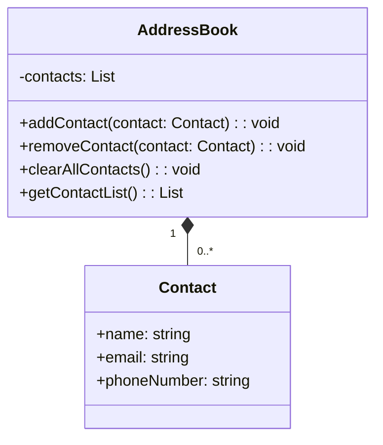
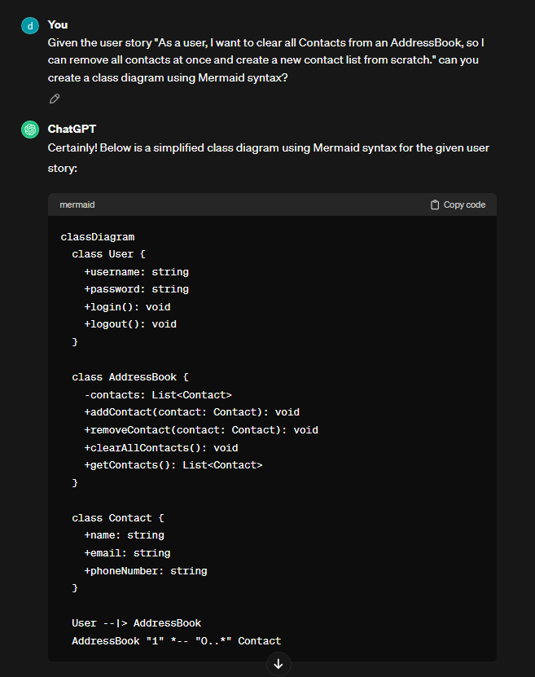
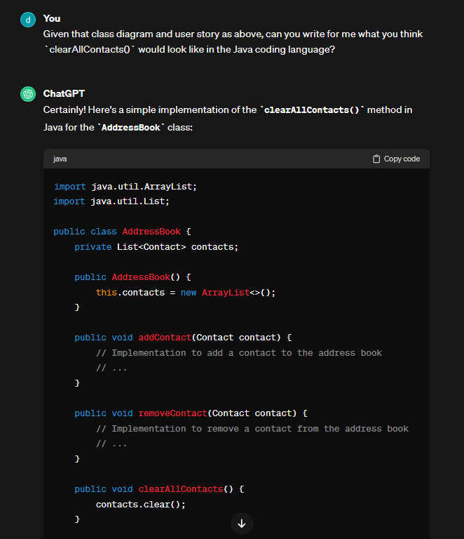
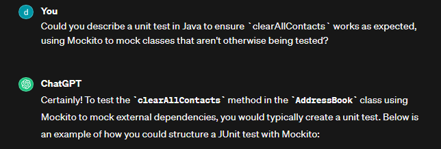
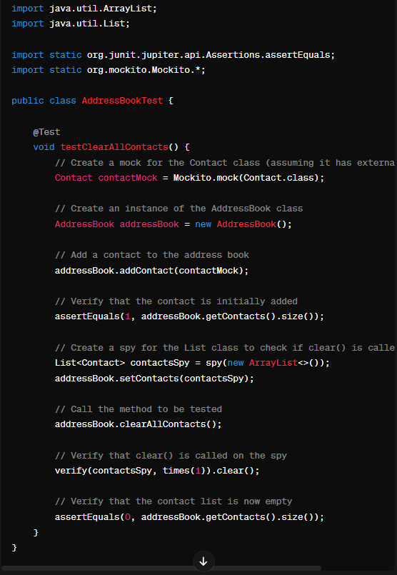

## AI assited further features

### User stories

1. As a user, I want to clear all contacts from an Address Book, so I can remove all contacts at once and create a new contact list from scratch.

### Class Diagram - Provided by ChatGPT

#### Evidence:

### Java Code

#### Evidence:

### Unit Test

#### Evidence:

