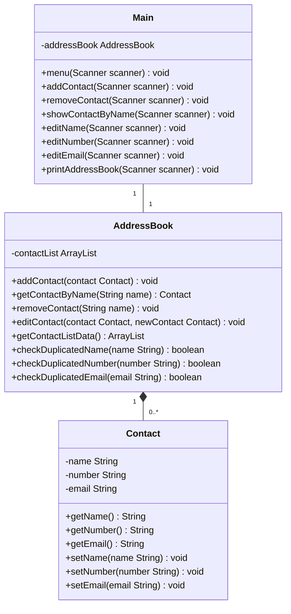

# Domain Models, Class Diagrams and Test Plan

## User Stories

1. As a user, I want to add contacts to my address book, so I can expand the number of contacts I have listed.
2. As a user, I want to search for a contact by name, so I can easily find contacts in an ever-growing list.
3. As a user, I want to remove a contact from my address book, in case I no longer need a contact, or it has incorrect or out of date information in it.
4. As a user, I want to edit a contact's details, so I can update the information in them as needed.
5. As a user, I want information to not be duplicated or be able to duplicate information, so I don't end up storing needless data.
6. As a user, I want to be able to view all my contacts in the address book, so I can see the information without having to search through or know the information in the first place.
7. As a user, I want to be able to interact with the application through the console, so I can actually put actions into effect through a meaningful way.

## Class Diagrams

## Test Plan

### AddressBook

- Does a contact equivalent to the parameter get added to the address book after `addContact()` is run?
- Does a contact get removed when `removeContact()` is run with a contact in the list?
- Does an error get thrown by `removeContact()` when a contact not in the list gets removed?
- Does the data in the edited contact get changed when `editContact()` is run?
- Does an error get thrown by `editContact()` when a contact not in the list gets edited?
- Does `checkDuplicatedName()` return true when the parameter is included in the `contactList`?
- Does `checkDuplicatedNumber()` return true when the parameter is included in the `contactList`?
- Does `checkDuplicatedEmail()` return true when the parameter is included in the `contactList`?

### Main
- Does `menu()` progress if it's given a '1' input, and can a user then add a contact?
- Does `menu()` progress if it's given a '2' input, and can a user then remove a contact?
- Does trying to remove a contact through the `menu()` that doesn't exist warn the user?
- Does `menu()` progress if it's given a '3' input, and can a user then find a contact by name? Does a 
- Does `editContact()` allow the user to edit a given Contact?
- Does duplicate data not get input into the AddressBook when using `addContact()`?
- Does duplicate data not get input into the AddressBook when using `editName()`/`editNumber()`/`editEmail()`?
- Does a name with numbers in it not get passed into the Contact?
- Does a number which doesn't follow the `^[0-9*#]$` structure not get passed into the Contact?
- Does an email which doesn't follow the `^[a-zA-Z0-9._-]+@[a-zA-Z0-9.-]+\.[a-zA-Z]{2,4}$` not get passed into the Contact?
